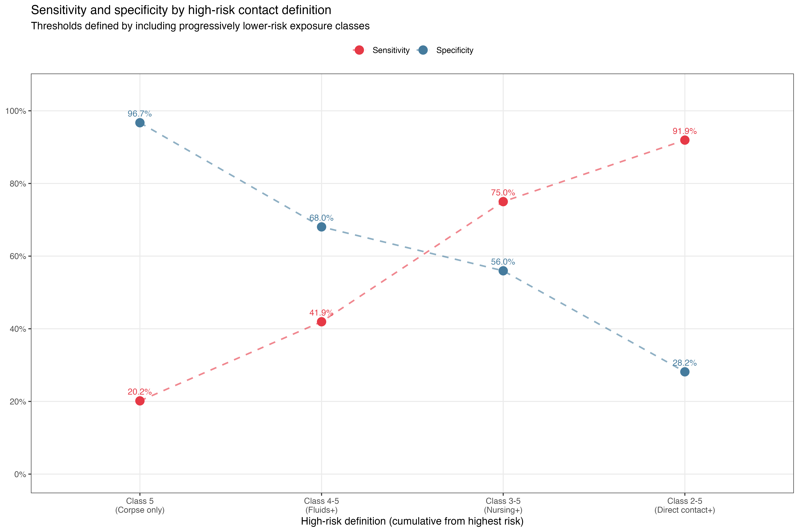

```{r}
#| label: load-packages
#| include: false

library(tidyverse)
```

<i>NB all French text has been written by Michelle's hazy GCSE memory with some help from ChatGPT and definitely needs reviewing by a native/proficient speaker please!</i>

::: panel-tabset
## Introduction

```{ojs}
//| panel: sidebar
viewof intro_language = {
  const form = html`
    <form>
      <label style="display:block; margin-bottom:0.4rem;">
        <input type="radio" name="lang" value="fr" checked>
        Français 🇫🇷 
      </label>
      <label style="display:block;">
        <input type="radio" name="lang" value="en">
        English 🇬🇧
      </label>
    </form>
  `;

  Object.defineProperty(form, "value", {
    get() {
      return form.querySelector('input[name="lang"]:checked').value;
    }
  });

  form.querySelectorAll("input").forEach((el) => {
    el.addEventListener("change", () => {
      form.dispatchEvent(new Event("input", { bubbles: true }));
    });
  });

  return form;
}
```


```{ojs}
//| panel: fill

intro_language === "fr"
  ? html`<p>Pour toute maladie infectieuse, la définition, en santé publique, d’un contact « à risque » détermine le nombre de personnes faisant l’objet d’un traçage des contacts pour chaque cas index. Cette définition implique un compromis entre la sensibilité et la spécificité, avec des conséquences sur la gestion de la maladie et l’utilisation des ressources.</p>

<p>Cette application web rassemble les données de nombreuses études antérieures sur les Ebolavirus afin de quantifier, pour différentes définitions d’un contact « à risque », (1) le nombre de contacts retracés et (2) le nombre de ces contacts qui sont ensuite testés positifs. Pour plus de détails, consultez l’onglet « Méthodes ».</p>`
  : html`<p>For any infectious disease, the Public Health definition of a 'risky' contact will affect how many individuals are contact-traced per index case.
With this definition come trade-offs for sensitivity and specificity, with implications for disease management and resource use.</p>

<p>This web app brings together data from many previous studies of <i>Ebolavirus</i>, to quantify for a variety of 'risky' contact definitions (1) the numbers of contacts traced, and (2) the number of these who go on to test positive. For more details see the 'methods' tab..</p>`


```


## Analysis 🇬🇧

*Under construction*

```{ojs}
data = FileAttachment("output/contact_risk_diagnostics_wide.csv").csv({ typed: true })

```

```{ojs}
//| panel: sidebar 

viewof contact_type = Inputs.radio(
  [
    "Class 5: Handled corpse only",
    "Class 4-5: Body fluid contact and above",
    "Class 3-5: Nursing care and above",
    "Class 2-5: Direct physical contact and above"
  ], 
  { label: html`<b>Contact type(s):</b>`, value: "Class 5: Handled corpse only"}
)

html`<br/>`

html`<b>Literature to include:</b> <i>note this doesn't change anything yet!</i>`

viewof literature_quality = Inputs.radio(
  ["All", "High quality only"],
  {
  value: "All",
  label: html`Filter by quality:</b>`
  }
)

viewof literature_strain = Inputs.checkbox(
  ["Zaire", "Sudan", "Bundibugyo"],
  {
  value: ["Zaire", "Sudan", "Bundibugyo"], 
  label: html`Filter by Ebolavirus strain:`
  }
)
```

```{ojs}
//| panel: fill
//| 

html`<i><b>Sensitivity:</b> Across the literature reviewed, a policy of tracing contacts classified as '${contactType}' would have resulted in <b>missing ${proportionMissed}%</b> of cases among contacts of an index case.</i>`

html`<br>`

html`<i><b>Specificity:</b> With this definition of a contact, <b>${specificity}%</b> of a case's contacts would be expected to go on to test positive.</i>`

html`<br>`

html`<i>Possibility to include more stats, a two-by-two table, maybe expected size of ring, SAR,...</i>`

html`<br>`

```

{fig-alt="Plot showing the tradeoffs in sensitivity and specificity of the classes of contact definition"}

```{ojs}

html`Full table for reference:`
Inputs.table(data)
```

```{ojs}
data_filtered = data.filter(
function(selection) {
  return contact_type.includes(selection.definition) ;
})

contactType = contact_type;
sar = data_filtered.map(d => d.sar);
sensitivity = data_filtered.map(d => d.sensitivity);
specificity = (data_filtered.map(d => d.specificity) * 100).toPrecision(3);
missedCases = data_filtered.map(d => d.missed_cases);
proportionMissed = (data_filtered.map(d => d.prop_missed) * 100).toPrecision(3) ;
```


## L'analyse 🇫🇷 

*Ce site est en cours de construction*

*Note from Michelle: I made it this far just to check I could have English and French versions operating separately on the same data. Will finish refining the English tab and then directly copy everything across to here. Can easily put this tab first if desired.*


```{ojs}
data_f = FileAttachment("output/contact_risk_diagnostics_wide.csv").csv({ typed: true })

```

```{ojs}
//| panel: sidebar 

viewof contact_type_f = Inputs.radio(
  [
    "Class 5: Handled corpse only",
    "Class 4-5: Body fluid contact and above",
    "Class 3-5: Nursing care and above",
    "Class 2-5: Direct physical contact and above"
  ], 
  { label: html`<b>Types of contact:</b>`, value: "Class 5: Handled corpse only"}
)


```

```{ojs}
//| panel: fill
//| 


html`<i>Across the literature reviewed, a policy of tracing contacts classified as '${contactType_f}' would have resulted in missing ${proportionMissed_f}% of cases.</i>`

html`<br>`

html`<i>With this definition, ${specificity_f}% of a case's contacts would be expected to go on to test positive.</i>`

html`<br>`

```

```{ojs}
data_filtered_f = data.filter(
function(selection) {
  return contact_type_f.includes(selection.definition) ;
})

contactType_f = contact_type_f;
sar_f = data_filtered_f.map(d => d.sar);
sensitivity_f = data_filtered_f.map(d => d.sensitivity);
specificity_f = (data_filtered_f.map(d => d.specificity) * 100).toPrecision(3);
missedCases_f = data_filtered_f.map(d => d.missed_cases);
proportionMissed_f = (data_filtered_f.map(d => d.prop_missed) * 100).toPrecision(3) ;
```


## Methods / Méthodes

*Under construction*

```{ojs}
//| panel: sidebar
viewof methods_language = {
  const form = html`
    <form>
      <label style="display:block; margin-bottom:0.4rem;">
        <input type="radio" name="lang" value="fr" checked>
        Français 🇫🇷 
      </label>
      <label style="display:block;">
        <input type="radio" name="lang" value="en">
        English 🇬🇧
      </label>
    </form>
  `;

  Object.defineProperty(form, "value", {
    get() {
      return form.querySelector('input[name="lang"]:checked').value;
    }
  });

  form.querySelectorAll("input").forEach((el) => {
    el.addEventListener("change", () => {
      form.dispatchEvent(new Event("input", { bubbles: true }));
    });
  });

  return form;
}
```

```{ojs}
//| panel: fill

methods_language === "fr"
  ? html`<p><i>Methods in French</i></p>`
  : html`<p><i>Methods in English</i></p>`

```


## About / À propos

*Under construction*


```{ojs}
//| panel: sidebar
viewof about_language = {
  const form = html`
    <form>
      <label style="display:block; margin-bottom:0.4rem;">
        <input type="radio" name="lang" value="fr" checked>
        Français 🇫🇷 
      </label>
      <label style="display:block;">
        <input type="radio" name="lang" value="en">
        English 🇬🇧
      </label>
    </form>
  `;

  Object.defineProperty(form, "value", {
    get() {
      return form.querySelector('input[name="lang"]:checked').value;
    }
  });

  form.querySelectorAll("input").forEach((el) => {
    el.addEventListener("change", () => {
      form.dispatchEvent(new Event("input", { bubbles: true }));
    });
  });

  return form;
}
```

```{ojs}
//| panel: fill

about_language === "fr"
  ? html`<p><i>About in French</i></p>`
  : html`<p><i>About in English. Include "authors" and "contact us via GitHub issues" link</i></p>`

```


:::
